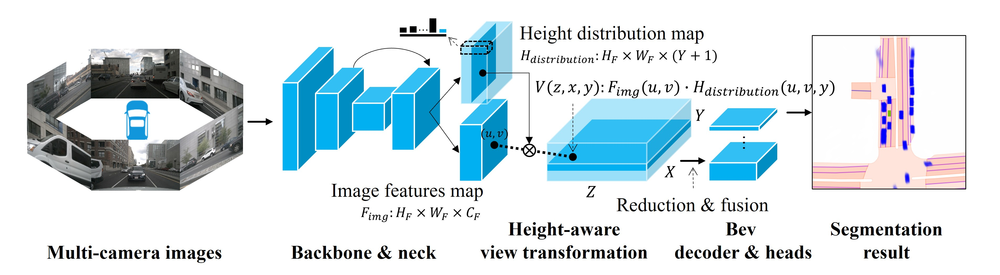

# HeightAware-BEV

A simple BEV perception framework which achieves efficient and accurate view transformation through
height-aware feature mapping.

> **Our paper has been accepted to IROS 2025!**

<div align="center">

</div>

## Introduction

<div align="center">

</div>
HeightAware-BEV is an efficient bird's-eye-view (BEV) perception framework that enables fast and accurate view transformation through height-aware feature mapping. 

## Main Results

<table border="1">
  <caption><i><b>State-of-the-art Comparison:</b> Vehicle segmentation of various static models at 448x800 image resolution with visibility filtering. More details can be found in our paper.</i></caption>
    <tr>
        <th>Models</th>
        <th>Publication</th>
        <th>Backbone</th>
        <th>IoU</th>
        <th>FPS</th>
    </tr>
    <tr class="highlight-column">
        <td><a href="https://arxiv.org/abs/2205.02833">CVT</a></td>
        <td>CVPR2022</td>
        <td>ENb4</td>
        <td>37.7</td>
        <td></td>
    </tr>
    <tr class="highlight-column">
        <td><a href="https://arxiv.org/abs/2203.17270">BEVFormer</a></td>
        <td>ECCV2022</td>
        <td>RN50</td>
        <td>45.5</td>
        <td></td>
    </tr>
    <tr class="highlight-column">
        <td><a href="https://arxiv.org/abs/2206.07959">SimpleBeV</a></td>
        <td>ICRA2023</td>
        <td>RN50</td>
        <td>46.6</td>
        <td></td>
    </tr>
    <tr class="highlight-column">
        <td><a href="https://arxiv.org/abs/2312.00703">PointBeV</a></td>
        <td>CVPR2024</td>
        <td>ENb4</td>
        <td>47.6</td>
        <td>15FPS A100</td>
    </tr>
    <tr class="highlight-column">
        <td>Ours</td>
        <td>IROS2025</td>
        <td>RN50</td>
        <td><b>47.8</b></td>
        <td>63FPS A40<br>60FPS 2080TI</td>
    </tr>
</table>

## Requirements

The lines below should set up a fresh environment with everything you need: 
```
conda create --name bev
source activate bev 
conda install pytorch=1.12.0 torchvision=0.13.0 cudatoolkit=11.3 -c pytorch
conda install pip
pip install -r requirements.txt
```

You will also need to download [nuScenes](https://www.nuscenes.org/) and its dependencies.

## Training

A sample training command is included in `train.sh`.

To train a model that matches our camera-only model, run a command like this:

```
python train_nuscenes.py \
       --exp_name="rgb_mine" \
       --max_iters=40000 \
       --log_freq=2000 \
       --save_freq=5000 \
       --dset='trainval' \
       --batch_size=16 \
       --grad_acc=2 \
       --use_scheduler=True \
       --data_dir='../nuscenes' \
       --log_dir='logs_nuscenes' \
       --ckpt_dir='checkpoints' \
       --res_scale=2 \
       --ncams=6 \
       --encoder_type='res50' \
       --do_rgbcompress=True \
       --use_height_aware=True \
       --device_ids=[0,1,2,3,4,5,6,7]
```

## Evaluation

A sample evaluation command is included in `eval.sh`.

To evaluate a camera-only model, run a command like this:
```
python eval_nuscenes.py \
       --batch_size=16 \
       --dset='trainval' \
       --data_dir='../nuscenes' \
       --log_dir='logs_eval_nuscenes_bevseg' \
       --init_dir='checkpoints/<model_name>' \
       --res_scale=2 \
       --ncams=6 \
       --encoder_type='res50' \
       --do_rgbcompress=True \
       --use_height_aware=True \
       --device_ids=[0,1,2,3]
```

## Citation

If you find our work helpful in your research, please consider citing our paper:

```bibtex
@inproceedings{0HeightAware,
  author={Zhou, Renjie and Li, Jiachen and Su, Zhen and Lu, Chao and Wang, Zhengjun},
  booktitle={2025 IEEE/RSJ International Conference on Intelligent Robots and Systems (IROS)}, 
  title={HeightAware-BEV: Height-Aware Feature Mapping for Efficient Bird’s-Eye-View Perception}, 
  year={2025},
  pages={6172-6178},
  doi={10.1109/IROS60139.2025.11247319}
}
```

## License

This project is licensed under the MIT License - see the [LICENSE](LICENSE) file for details.

## Acknowledgement

This work is built upon the excellent [SimpleBEV](https://github.com/aharley/simple_bev). We thank the authors for releasing their code.
